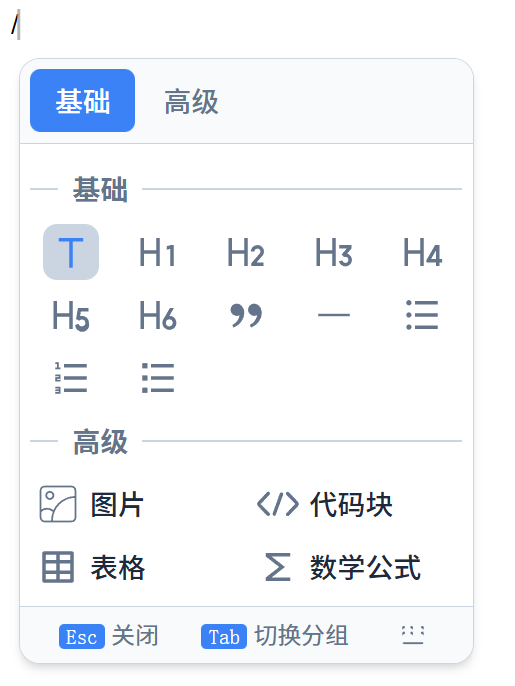

# @xz-summer/milkdown-slash-menu-core

功能丰富的 [Milkdown](https://milkdown.dev) 斜杠菜单插件，支持 React 和 Vue。

> 📖 [English Documentation](./README.en.md)

## 特性

- 🎯 **框架无关** - 核心逻辑与渲染分离
- 📦 **注册表模式** - 灵活扩展菜单项
- 🔍 **智能搜索** - 支持分组/菜单项标签、关键词、拼音模糊匹配
- ⌨️ **完整键盘支持** - 方向键、Tab 切换分组、Home/End 跳转
- 🎨 **多种布局** - list、grid、icon-grid
- 🌐 **国际化** - 内置中英文，支持自定义
- 🎛️ **三层自定义** - 菜单项、分组、整体渲染
- ♿ **无障碍** - 完整 ARIA 属性支持
- 🔌 **事件钩子** - onOpen、onClose、onSelect、onFilter
- 📐 **智能定位** - 自适应高度、方向锁定、位置固定点
- 🔢 **精确排序** - 支持 priority 粗排和 position 精确定位

## 预览



## 安装

```bash
# React
pnpm add @xz-summer/milkdown-slash-menu-react

# Vue
pnpm add @xz-summer/milkdown-slash-menu-vue

# 仅核心包（自定义渲染器）
pnpm add @xz-summer/milkdown-slash-menu-core
```

## 快速开始

### React

```tsx
import { Editor } from "@milkdown/kit/core";
import { commonmark } from "@milkdown/kit/preset/commonmark";
import { 
  slashMenuPlugin, 
  slashMenuConfig, 
  mergeSlashMenuConfig 
} from "@xz-summer/milkdown-slash-menu-react";

const editor = await Editor.make()
  .use(commonmark)
  .use(slashMenuPlugin)
  .config((ctx) => {
    ctx.update(slashMenuConfig.key, mergeSlashMenuConfig({
      locale: "zh-CN",
    }));
  })
  .create();
```

### Vue

```vue
<script setup lang="ts">
import { Milkdown, useEditor } from "@milkdown/vue";
import { 
  slashMenuPlugin, 
  slashMenuConfig, 
  mergeSlashMenuConfig 
} from "@xz-summer/milkdown-slash-menu-vue";

useEditor((root) => {
  return Editor.make()
    .use(commonmark)
    .use(slashMenuPlugin)
    .config((ctx) => {
      ctx.update(slashMenuConfig.key, mergeSlashMenuConfig({
        locale: "zh-CN",
      }));
    });
});
</script>

<template>
  <Milkdown />
</template>
```

### 与 Crepe 一起使用

```tsx
import { Crepe } from "@milkdown/crepe";
import { 
  slashMenuPlugin, 
  slashMenuConfig, 
  mergeSlashMenuConfig 
} from "@xz-summer/milkdown-slash-menu-react";

const crepe = new Crepe({
  root,
  features: {
    [Crepe.Feature.BlockEdit]: false,  // 禁用 Crepe 内置斜杠菜单
  },
});

crepe.editor
  .use(slashMenuPlugin)
  .config((ctx) => {
    ctx.update(slashMenuConfig.key, mergeSlashMenuConfig({
      locale: "zh-CN",
    }));
  });
```

## 配置方式

斜杠菜单提供两种配置方式：

### 方式 1：ctx.update + mergeSlashMenuConfig（推荐）

使用 `ctx.update` 配合 `mergeSlashMenuConfig` 工具函数，支持深度合并：

```typescript
import { 
  slashMenuPlugin, 
  slashMenuConfig, 
  mergeSlashMenuConfig,
  DEFAULT_GROUP_IDS,
} from "@xz-summer/milkdown-slash-menu-vue";

editor
  .use(slashMenuPlugin)
  .config((ctx) => {
    ctx.update(slashMenuConfig.key, mergeSlashMenuConfig({
      locale: 'zh-CN',
      pluginOptions: {
        trigger: '/',
        floating: { maxHeight: 400 },
      },
      // 修改分组配置（数组结构，按 id 合并）
      groups: [
        { 
          id: DEFAULT_GROUP_IDS.BASIC, 
          layout: 'list',
          showDescription: true,
        },
        {
          id: DEFAULT_GROUP_IDS.ADVANCED,
          items: [
            {
              id: 'mermaid',
              label: '流程图',
              icon: mermaidIcon,
              keywords: ['mermaid', 'diagram', '流程图'],
              position: { after: 'code' },  // 插入到 code 后面
              action: (ctx) => { /* ... */ },
            },
          ],
        },
      ],
    }));
  })
  .create();
```

### 方式 2：Registry API（动态注册）

使用 `menuRegistryCtx` 动态注册分组和菜单项：

```typescript
import { 
  slashMenuPlugin, 
  menuRegistryCtx,
  DEFAULT_GROUP_IDS,
} from "@xz-summer/milkdown-slash-menu-vue";

editor
  .use(slashMenuPlugin)
  .config((ctx) => {
    const registry = ctx.get(menuRegistryCtx.key);
    
    // 注册新分组
    registry.registerGroup({
      id: 'ai',
      label: 'AI 助手',
      position: { index: 0 },  // 插入到最前面
      items: [
        { id: 'ai-write', label: 'AI 写作', action: () => {} },
      ],
    });
    
    // 在已有分组中插入菜单项
    registry.insertItemAfter(DEFAULT_GROUP_IDS.ADVANCED, 'code', {
      id: 'mermaid',
      label: '流程图',
      action: () => {},
    });
  })
  .create();
```

## 配置结构

### SlashMenuConfig

```typescript
interface SlashMenuConfig {
  /** 语言，默认 "zh-CN" */
  locale: LocaleType;
  /** i18n 配置 */
  i18n: SlashMenuI18n;
  /** 分组配置（数组结构，按 id 合并） */
  groups: MenuGroupConfig[];
  /** 是否注册默认菜单项，默认 true */
  registerDefaults: boolean;
  /** 默认菜单配置 */
  defaultMenuOptions: {
    enableImage: boolean;
    enableTable: boolean;
    enableMath: boolean;
  };
  /** 插件选项 */
  pluginOptions: SlashMenuOptions;
  /** 渲染器工厂（由框架包自动设置） */
  rendererFactory?: RendererFactory;
}
```

### MenuGroupConfig（分组配置）

```typescript
interface MenuGroupConfig {
  id: string;
  /** 标签，可选。不指定则由 i18n 系统根据 id 获取 */
  label?: string;
  /** 分组关键词，搜索时匹配 */
  keywords?: string[];
  /** 布局类型 */
  layout?: "list" | "grid" | "icon-grid";
  /** 最大列数（仅 grid/icon-grid 有效） */
  columns?: number;
  /** 是否显示描述（仅 list 布局有效） */
  showDescription?: boolean;
  /** 排序优先级，数值越大越靠前 */
  priority?: number;
  /** 精确位置控制 */
  position?: Position;
  /** 菜单项列表 */
  items?: MenuItemConfig[];
  /** 自定义分组渲染 */
  renderGroup?: (props: GroupRenderProps) => unknown;
}
```

### MenuItemConfig（菜单项配置）

```typescript
interface MenuItemConfig {
  id: string;
  /** 标签，可选。不指定则由 i18n 系统根据 id 获取 */
  label?: string;
  /** 搜索关键词 */
  keywords?: string[];
  /** 图标（SVG 字符串） */
  icon?: string;
  /** 描述文本 */
  description?: string;
  /** 是否禁用 */
  disabled?: boolean;
  /** 点击执行的操作 */
  action: (ctx: Ctx) => void;
  /** 排序优先级，数值越大越靠前 */
  priority?: number;
  /** 精确位置控制 */
  position?: Position;
  /** 自定义菜单项渲染 */
  renderItem?: (props: ItemRenderProps) => unknown;
}
```

### Position（位置配置）

```typescript
interface Position {
  /** 插入到指定 id 之前 */
  before?: string;
  /** 插入到指定 id 之后 */
  after?: string;
  /** 插入到指定索引位置 */
  index?: number;
}
```

## 排序逻辑

分组和菜单项的排序遵循以下规则：

### 排序优先级

1. **position** - 精确位置控制，优先级最高
2. **priority** - 粗排权重，数值越大越靠前

### 排序流程

```
1. 分离有 position 和没有 position 的项
2. 没有 position 的项按 priority 降序排列
3. 处理有 position 的项：
   - index: 插入到指定索引位置
   - before: 插入到目标 id 之前
   - after: 插入到目标 id 之后
4. 如果目标不存在，追加到末尾
```

### 使用示例

```typescript
// 使用 priority 粗排
registry.registerGroup({
  id: 'ai',
  label: 'AI',
  priority: 200,  // 数值大，排在前面
  items: [...],
});

// 使用 position 精确定位
registry.registerGroup({
  id: 'containers',
  label: '容器',
  position: { after: 'basic' },  // 插入到 basic 后面
  items: [...],
});

// 使用 index 指定位置
registry.registerGroup({
  id: 'quick',
  label: '快捷',
  position: { index: 0 },  // 插入到最前面
  items: [...],
});

// 菜单项也支持 position
registry.insertItemAfter('advanced', 'code', {
  id: 'mermaid',
  label: '流程图',
  // 内部自动设置 position: { after: 'code' }
  action: () => {},
});
```

### 默认分组优先级

| 分组 | priority |
|------|----------|
| basic | 100 |
| advanced | 80 |

## 菜单注册表 API

### 获取注册表

```typescript
import { menuRegistryCtx } from "@xz-summer/milkdown-slash-menu-vue";

const registry = ctx.get(menuRegistryCtx.key);
```

### 注册分组

```typescript
registry.registerGroup({
  id: "custom",
  label: "自定义",
  keywords: ["custom", "自定义", "zdy"],
  layout: "list",
  showDescription: true,
  priority: 50,
  items: [
    {
      id: "custom-item",
      label: "自定义项",
      icon: "<svg>...</svg>",
      description: "描述文本",
      keywords: ["custom"],
      action: (ctx) => { /* ... */ },
    },
  ],
});
```

### 注册菜单项

```typescript
// 向已有分组添加菜单项
registry.registerItem("basic", {
  id: "my-item",
  label: "我的菜单项",
  action: (ctx) => {},
});
```

### 插入分组（精确位置）

```typescript
// 在 basic 前插入
registry.insertGroupBefore("basic", {
  id: "quick",
  label: "快捷",
  items: [...],
});

// 在 basic 后插入
registry.insertGroupAfter("basic", {
  id: "containers",
  label: "容器",
  items: [...],
});
```

### 插入菜单项（精确位置）

```typescript
// 在 code 前插入
registry.insertItemBefore("advanced", "code", {
  id: "diagram",
  label: "图表",
  action: () => {},
});

// 在 code 后插入
registry.insertItemAfter("advanced", "code", {
  id: "mermaid",
  label: "流程图",
  action: () => {},
});
```

### 更新

```typescript
// 更新菜单项
registry.updateItem("h1", {
  label: "大标题",
  keywords: ["big", "title"],
});

// 更新分组
registry.updateGroup("basic", {
  layout: "grid",
  columns: 3,
});
```

### 删除

```typescript
// 删除菜单项
registry.unregisterItem("math");

// 删除分组
registry.unregisterGroup("advanced");

// 过滤菜单项
registry.filterItems("basic", (item) => !["h4", "h5", "h6"].includes(item.id));

// 过滤分组
registry.filterGroups((group) => group.id !== "advanced");
```

### 查询

```typescript
// 获取所有分组（已排序）
const groups = registry.getGroups();

// 获取单个分组
const basicGroup = registry.getGroup("basic");

// 获取分组内的菜单项（已排序）
const items = registry.getItems("basic");

// 获取单个菜单项
const h1Item = registry.getItem("h1");

// 获取所有菜单项
const allItems = registry.getAllItems();
```

## 默认 ID 常量

```typescript
import { DEFAULT_GROUP_IDS, DEFAULT_ITEM_IDS } from "@xz-summer/milkdown-slash-menu-vue";

// 分组 ID
DEFAULT_GROUP_IDS.BASIC     // "basic"
DEFAULT_GROUP_IDS.ADVANCED  // "advanced"

// 菜单项 ID
DEFAULT_ITEM_IDS.TEXT         // "text"
DEFAULT_ITEM_IDS.H1           // "h1"
DEFAULT_ITEM_IDS.H2           // "h2"
DEFAULT_ITEM_IDS.H3           // "h3"
DEFAULT_ITEM_IDS.H4           // "h4"
DEFAULT_ITEM_IDS.H5           // "h5"
DEFAULT_ITEM_IDS.H6           // "h6"
DEFAULT_ITEM_IDS.QUOTE        // "quote"
DEFAULT_ITEM_IDS.DIVIDER      // "divider"
DEFAULT_ITEM_IDS.BULLET_LIST  // "bullet-list"
DEFAULT_ITEM_IDS.ORDERED_LIST // "ordered-list"
DEFAULT_ITEM_IDS.TASK_LIST    // "task-list"
DEFAULT_ITEM_IDS.IMAGE        // "image"
DEFAULT_ITEM_IDS.CODE         // "code"
DEFAULT_ITEM_IDS.TABLE        // "table"
DEFAULT_ITEM_IDS.MATH         // "math"
```

## 插件选项

```typescript
ctx.update(slashMenuConfig.key, mergeSlashMenuConfig({
  pluginOptions: {
    // 触发字符，默认 "/"
    trigger: "/",
    
    // 是否显示快捷键提示，默认 true
    showShortcutHints: true,
    
    // 浮动定位配置
    floating: {
      offset: 10,           // 偏移量
      placement: "bottom",  // 优先方向 "top" | "bottom"
      width: 260,           // 菜单宽度
      maxHeight: 440,       // 最大高度
      minHeight: 100,       // 最小高度
      padding: 10,          // 距视口边缘安全距离
    },
    
    // 事件钩子
    onOpen: () => {},
    onClose: () => {},
    onSelect: (item) => {},
    onFilter: (query, results) => {},
  },
}));
```

## i18n 配置

### 配置结构

```typescript
interface SlashMenuI18n {
  [locale: string]: LocaleConfig;
}

interface LocaleConfig {
  groups?: Record<string, string>;
  items?: Record<string, { label?: string; desc?: string }>;
  ui?: {
    noResults?: string;
    navigate?: string;
    select?: string;
    close?: string;
  };
}
```

### 翻译优先级

1. **用户 i18n 配置** - `mergeSlashMenuConfig` 中的 `i18n`
2. **注册时指定值** - `registerGroup` / `registerItem` 时的 `label`
3. **内置语言包** - 插件内置的中英文翻译

### 使用示例

```typescript
ctx.update(slashMenuConfig.key, mergeSlashMenuConfig({
  locale: "zh-CN",
  i18n: {
    "zh-CN": {
      groups: {
        basic: "基础块",
        containers: "容器",
      },
      items: {
        h1: { label: "大标题", desc: "文章主标题" },
        "container-info": { label: "信息框", desc: "信息提示" },
      },
      ui: {
        noResults: "没有找到匹配项",
      },
    },
  },
}));
```

## 自定义渲染

### 自定义菜单项

```tsx
registry.registerGroup({
  id: "ai",
  label: "AI",
  items: [
    {
      id: "ai-write",
      label: "AI 写作",
      icon: aiIcon,
      action: () => {},
      renderItem: (props) => (
        <li
          data-index={props.item.index}
          className={`${CLASS_NAMES.item} ${props.isActive ? CLASS_NAMES.itemActive : ""}`}
          onPointerEnter={props.onHover}
          onPointerUp={props.onSelect}
        >
          <span dangerouslySetInnerHTML={{ __html: props.item.icon }} />
          <span>{props.item.label}</span>
          <span className="ai-badge">AI</span>
        </li>
      ),
    },
  ],
});
```

### 自定义分组

```tsx
registry.registerGroup({
  id: "ai",
  label: "AI 助手",
  renderGroup: (props) => (
    <div className={CLASS_NAMES.group}>
      <div className={CLASS_NAMES.groupLabel}>
        ✨ {props.group.label}
      </div>
      <ul className={CLASS_NAMES.groupItems}>
        {props.group.items.map((item) => (
          <MyCustomItem key={item.id} {...props} item={item} />
        ))}
      </ul>
    </div>
  ),
  items: [...],
});
```

### 使用插槽

```typescript
ctx.update(slashMenuConfig.key, mergeSlashMenuConfig({
  pluginOptions: {
    slots: {
      beforeHeader: () => <div>标签栏前</div>,
      afterHeader: () => <div>标签栏后</div>,
      footer: () => <div>自定义底部</div>,
      empty: () => <div>🔍 没有找到</div>,
    },
  },
}));
```

## 键盘快捷键

| 快捷键 | 功能 |
|--------|------|
| `↑` / `↓` | 上下导航 |
| `Enter` | 选择当前项 |
| `Esc` | 关闭菜单 |
| `Tab` / `Shift+Tab` | 切换分组 |
| `Home` | 跳转到第一项 |
| `End` | 跳转到最后一项 |

## 搜索逻辑

### 匹配范围（按优先级）

1. **菜单项标签** (`item.label`)
2. **菜单项关键词** (`item.keywords`)
3. **分组标签** (`group.label`)
4. **分组关键词** (`group.keywords`)

### 匹配规则

- 不区分大小写
- 支持部分匹配
- 匹配任意维度即显示

### 排序评分

| 匹配类型 | 完全匹配 | 前缀匹配 | 包含匹配 |
|----------|----------|----------|----------|
| 菜单项标签 | 100 | 80 | 60 |
| 菜单项关键词 | 90 | 70 | 50 |
| 分组标签 | 40 | 30 | 20 |
| 分组关键词 | 35 | 25 | 15 |

## CSS 变量

```css
:root {
  --milkdown-slash-menu-bg: #fff;
  --milkdown-slash-menu-border: #cbd5e1;
  --milkdown-slash-menu-text: #1e293b;
  --milkdown-slash-menu-text-secondary: #64748b;
  --milkdown-slash-menu-hover-bg: #cbd5e1;
  --milkdown-slash-menu-tab-bg: #f8fafc;
  --milkdown-slash-menu-tab-active: #3b82f6;
  --milkdown-slash-menu-border-radius: 12px;
  --milkdown-slash-menu-item-radius: 8px;
  --milkdown-slash-menu-icon-size: 28px;
  --milkdown-slash-menu-grid-columns: 2;
  --milkdown-slash-menu-icon-grid-columns: 5;
  --milkdown-slash-menu-transition: 0.15s ease;
  --milkdown-slash-menu-shadow: 0 4px 6px -1px rgb(0 0 0 / 0.1);
}

/* 暗色模式 */
.dark .milkdown-slash-menu {
  --milkdown-slash-menu-bg: #1e293b;
  --milkdown-slash-menu-border: #334155;
  --milkdown-slash-menu-text: #f1f5f9;
  --milkdown-slash-menu-text-secondary: #94a3b8;
  --milkdown-slash-menu-hover-bg: #334155;
  --milkdown-slash-menu-tab-bg: #0f172a;
}
```

## 编程式控制

```typescript
import { slashMenuAPI } from "@xz-summer/milkdown-slash-menu-vue";

const api = ctx.get(slashMenuAPI.key);

// 显示菜单
api.show(cursorPosition);

// 隐藏菜单
api.hide();
```

## License

MIT
