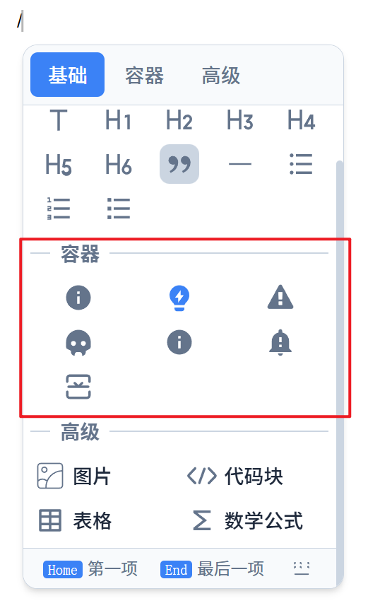
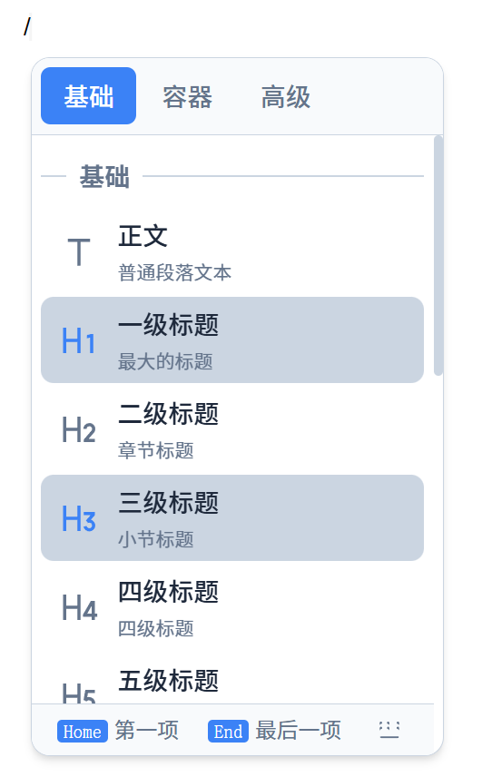

# @xz-summer/milkdown-slash-menu-core

功能丰富的 [Milkdown](https://milkdown.dev) 斜杠菜单插件，支持 React 和 Vue。

> 📖 [English Documentation](./README.en.md)

## 特性

- 🎯 **框架无关** - 核心逻辑与渲染分离
- 📦 **注册表模式** - 灵活扩展菜单项
- 🔍 **智能搜索** - 支持分组/菜单项标签、关键词、拼音模糊匹配
- ⌨️ **完整键盘支持** - 方向键、Tab 切换分组、Home/End 跳转
- 🎨 **多种布局** - list、grid、icon-grid
- 🌐 **国际化** - 内置中英文，支持自定义
- 🎛️ **三层自定义** - 菜单项、分组、整体渲染
- ♿ **无障碍** - 完整 ARIA 属性支持
- 🔌 **事件钩子** - onOpen、onClose、onSelect、onFilter
- 📐 **智能定位** - 自适应高度、方向锁定、位置固定点

## 预览


## 安装

```bash
# React
pnpm add @xz-summer/milkdown-slash-menu-react

# Vue
pnpm add @xz-summer/milkdown-slash-menu-vue

# 仅核心包（自定义渲染器）
pnpm add @xz-summer/milkdown-slash-menu-core
```

## 快速开始

### React

```tsx
import { Editor } from "@milkdown/kit/core";
import { commonmark } from "@milkdown/kit/preset/commonmark";
import { slashMenuPlugins, configureSlashMenu } from "@xz-summer/milkdown-slash-menu-react";

const editor = await Editor.make()
  .use(commonmark)
  .use(slashMenuPlugins)
  .config((ctx) => {
    configureSlashMenu(ctx, {
      locale: "zh-CN",  // 或 "en"
    });
  })
  .create();
```

### Vue

```vue
<script setup lang="ts">
import { Milkdown, useEditor } from "@milkdown/vue";
import { slashMenuPlugins, configureSlashMenu } from "@xz-summer/milkdown-slash-menu-vue";

useEditor((root) => {
  return Editor.make()
    .use(commonmark)
    .use(slashMenuPlugins)
    .config((ctx) => {
      configureSlashMenu(ctx);
    });
});
</script>

<template>
  <Milkdown />
</template>
```

### 与 Crepe 一起使用

```tsx
import { Crepe } from "@milkdown/crepe";
import { slashMenuPlugins, configureSlashMenu } from "@xz-summer/milkdown-slash-menu-react";

const crepe = new Crepe({
  root,
  featureConfigs: {
    [Crepe.Feature.BlockEdit]: {
      // 禁用 Crepe 内置斜杠菜单
      textGroup: null,
      listGroup: null,
      advancedGroup: null,
    },
  },
});

crepe.editor
  .use(slashMenuPlugins)
  .config((ctx) => {
    configureSlashMenu(ctx);
  });
```

### 注意事项

> ⚠️ **重要**：`configureSlashMenu` 必须在 `.config()` 中调用，确保在 `create()` 之前执行。在 `create()` 之后调用会导致配置不生效。

> 💡 **提示**：`registry.registerGroup()` 和 `registry.registerItem()` 也可以在 `.config()` 中调用，因为 `menuRegistryCtx` 在 `.use(slashMenuPlugin)` 时已注入。

## 配置选项

### configureSlashMenu

```typescript
configureSlashMenu(ctx, {
  // 触发字符，默认 "/"
  trigger: "/",
  
  // 语言，默认 "zh-CN"
  locale: "zh-CN",  // "zh-CN" | "en"
  
  // i18n 配置（按语言分组）
  i18n: {
    "zh-CN": {
      groups: { basic: "基础块" },
      items: { 
        h1: { label: "大标题", desc: "文章主标题" } 
      },
      ui: { noResults: "没有找到" }
    },
    "en": {
      groups: { basic: "Basic Blocks" },
      items: { 
        h1: { label: "Big Heading", desc: "Main title" } 
      },
      ui: { noResults: "Nothing found" }
    }
  },
  
  // 是否注册默认菜单项，默认 true
  registerDefaults: true,
  
  // 默认菜单配置
  defaultMenuOptions: {
    enableImage: true,   // 启用图片，默认 true
    enableTable: true,   // 启用表格，默认 true
    enableMath: true,    // 启用数学公式，默认 true
  },
  
  // 是否显示快捷键提示，默认 true
  showShortcutHints: true,
  
  // 浮动定位与尺寸配置
  floating: {
    offset: 10,           // 偏移量，默认 10
    placement: "bottom",  // 优先方向，"top" | "bottom"，默认 "bottom"
    width: 260,           // 菜单宽度，默认 260
    maxHeight: 440,       // 最大高度，默认 440（空间不足时自动缩小）
    minHeight: 100,       // 最小高度，默认 100
    padding: 10,          // 距离视口边缘的安全距离，默认 10
  },
  
  // 事件钩子
  onOpen: () => console.log("菜单打开"),
  onClose: () => console.log("菜单关闭"),
  onSelect: (item) => console.log("选择:", item.label),
  onFilter: (query, results) => console.log("搜索:", query, results.length),
});
```

### 浮动定位特性

斜杠菜单使用智能浮动定位系统，具有以下特性：

#### 自适应高度

- `maxHeight` 设置菜单的最大高度（默认 440px）
- 当可用空间不足时，菜单高度会自动缩小以适应空间
- 高度不会低于 `minHeight`（默认 100px）
- 实际高度 = `min(maxHeight, 可用空间 - padding)`

```typescript
// 示例：限制菜单最大高度为 300px
configureSlashMenu(ctx, {
  floating: {
    maxHeight: 300,
    minHeight: 80,
  },
});
```

#### 智能方向选择

菜单会根据可用空间智能选择展开方向：

1. 如果配置方向（`placement`）的空间 >= `maxHeight`，使用配置方向
2. 如果配置方向空间不足 `maxHeight`，但另一方空间更大且 >= `minHeight`，翻转到另一方
3. 否则使用配置方向（即使空间不足也不翻转）

```
场景：配置 placement: "bottom"，maxHeight: 440

光标在页面顶部：
  下方空间 500px >= 440px → 向下展开 ✅

光标在页面中部偏下：
  下方空间 200px < 440px
  上方空间 400px > 200px 且 >= 100px → 向上展开 ✅

光标在页面底部：
  下方空间 50px < 440px
  上方空间 30px < 50px → 向下展开（配置方向）
```

#### 方向锁定

- 菜单首次打开时，根据光标位置和可用空间决定展开方向（向上或向下）
- **同一次打开期间，方向保持锁定**，不会因为过滤后内容减少而翻转
- 关闭菜单后重新打开会重新计算方向

#### 位置固定点

- **向下展开**：菜单顶部固定在光标位置，内容向下增长
- **向上展开**：菜单底部固定在光标位置，内容向上增长
- 过滤内容时，菜单始终以光标位置为固定点收缩/扩展

```
向下展开 (bottom)          向上展开 (top)
                          
光标 ─┬─────────┐          ┌─────────┬─ 光标
      │ 菜单项1 │          │ 菜单项1 │
      │ 菜单项2 │          │ 菜单项2 │
      │ 菜单项3 │          │ 菜单项3 │
      └─────────┘          └─────────┘
      ↓ 内容向下增长        ↑ 内容向上增长
```

#### 配置优先方向

```typescript
// 优先向上展开（空间不足时自动向下）
configureSlashMenu(ctx, {
  floating: {
    placement: "top",
  },
});

// 优先向下展开（默认，空间不足时自动向上）
configureSlashMenu(ctx, {
  floating: {
    placement: "bottom",
  },
});
```

### i18n 配置结构

```typescript
// i18n 配置类型
interface SlashMenuI18n {
  [locale: string]: LocaleConfig;
}

interface LocaleConfig {
  // 分组标签
  groups?: Record<string, string>;
  // 菜单项（标签 + 描述）
  items?: Record<string, { label?: string; desc?: string }>;
  // UI 文本
  ui?: {
    noResults?: string;
    navigate?: string;
    select?: string;
    close?: string;
    switchGroup?: string;
    firstItem?: string;
    lastItem?: string;
    expand?: string;
    collapse?: string;
  };
}
```

### i18n 翻译优先级

标签和描述的翻译遵循以下优先级（从高到低）：

1. **用户 i18n 配置** - `configureSlashMenu` 中传入的 `i18n` 配置
2. **注册时指定值** - `registerGroup` / `registerItem` 时指定的 `label` / `description`
3. **内置语言包** - 插件内置的中英文翻译

```typescript
// 示例：优先级演示
configureSlashMenu(ctx, {
  locale: "zh-CN",
  i18n: {
    "zh-CN": {
      items: {
        h1: { label: "主标题" },  // 优先级 1：用户 i18n
      },
    },
  },
});

// 注册自定义菜单项
registry.registerItem("basic", {
  id: "my-item",
  label: "我的菜单项",  // 优先级 2：注册时指定
  action: (ctx) => {},
});

// 默认菜单项（如 h2）使用内置语言包  // 优先级 3：内置语言包
```

**适用场景：**

| 场景 | 推荐方式 |
|------|----------|
| 覆盖默认菜单项的翻译 | 使用 `i18n` 配置 |
| 自定义菜单项（单语言） | 注册时直接指定 `label` |
| 自定义菜单项（多语言） | 注册时不指定 `label`，通过 `i18n` 配置各语言翻译 |

### i18n 使用示例

```typescript
configureSlashMenu(ctx, {
  locale: "zh-CN",
  i18n: {
    "zh-CN": {
      groups: {
        basic: "基础块",
        containers: "容器",  // 自定义分组
      },
      items: {
        text: { label: "段落", desc: "普通段落文本" },
        h1: { label: "大标题", desc: "文章主标题" },
        // 只覆盖标签
        h2: { label: "中标题" },
        // 只覆盖描述
        h3: { desc: "小节标题" },
        // 自定义菜单项
        "container-info": { label: "信息框", desc: "信息提示" },
      },
      ui: {
        noResults: "没有找到匹配项",
      }
    },
    "en": {
      groups: {
        basic: "Basic",
        containers: "Containers",
      },
      items: {
        text: { label: "Paragraph", desc: "Plain text" },
        h1: { label: "Heading 1", desc: "Main title" },
        "container-info": { label: "Info", desc: "Information callout" },
      },
      ui: {
        noResults: "No matches found",
      }
    }
  }
});
```

## 菜单注册表 API

### 获取注册表

```typescript
import { menuRegistryCtx } from "@xz-summer/milkdown-slash-menu-react";

// 在 configureSlashMenu 之后
const registry = ctx.get(menuRegistryCtx.key);
```

### 注册分组和菜单项

```typescript
// 注册新分组（带菜单项）
registry.registerGroup({
  id: "custom",
  label: "自定义",
  keywords: ["custom", "自定义", "zidingyi", "zdy"],  // 分组关键词，搜索时匹配
  layout: "list",      // "list" | "grid" | "icon-grid"
  columns: 2,          // 最大列数（仅 grid/icon-grid 布局有效），空间不足时自动换行
  showDescription: true, // 是否显示描述（仅 list 布局有效），默认 false
  priority: 50,        // 排序权重，越大越靠前
  items: [
    {
      id: "custom-item",
      label: "自定义项",
      icon: "<svg>...</svg>",
      description: "这是描述文本",
      keywords: ["custom", "自定义", "zidingyi"],
      action: (ctx) => {
        // 执行操作
      },
    },
  ],
});

// 向已有分组添加菜单项
registry.registerItem("basic", {
  id: "my-item",
  label: "我的菜单项",
  action: (ctx) => {},
});
```



布局变更效果（icon-grid → list）：



### 更新菜单项

```typescript
import { DEFAULT_ITEM_IDS } from "@xz-summer/milkdown-slash-menu-react";

// 更新标签和关键词
registry.updateItem(DEFAULT_ITEM_IDS.H1, {
  label: "大标题",
  keywords: ["big", "title", "大标题"],
});

// 更新分组
registry.updateGroup("basic", {
  label: "基础格式",
  layout: "grid",
});
```

### 删除菜单项

```typescript
import { DEFAULT_GROUP_IDS, DEFAULT_ITEM_IDS } from "@xz-summer/milkdown-slash-menu-react";

// 删除单个菜单项
registry.unregisterItem(DEFAULT_ITEM_IDS.MATH);

// 删除整个分组
registry.unregisterGroup(DEFAULT_GROUP_IDS.ADVANCED);

// 过滤菜单项（保留 h1-h3）
registry.filterItems(DEFAULT_GROUP_IDS.BASIC, (item) => {
  return ![DEFAULT_ITEM_IDS.H4, DEFAULT_ITEM_IDS.H5, DEFAULT_ITEM_IDS.H6].includes(item.id);
});

// 过滤分组
registry.filterGroups((group) => group.id !== "advanced");
```

### 查询

```typescript
// 获取所有分组
const groups = registry.getGroups();

// 获取单个分组
const basicGroup = registry.getGroup("basic");

// 获取分组内的菜单项
const items = registry.getItems("basic");

// 获取单个菜单项
const h1Item = registry.getItem("h1");

// 获取所有菜单项
const allItems = registry.getAllItems();
```

## 默认 ID 常量

```typescript
import { DEFAULT_GROUP_IDS, DEFAULT_ITEM_IDS } from "@xz-summer/milkdown-slash-menu-react";

// 分组 ID
DEFAULT_GROUP_IDS.BASIC     // "basic"
DEFAULT_GROUP_IDS.ADVANCED  // "advanced"

// 菜单项 ID
DEFAULT_ITEM_IDS.TEXT         // "text"
DEFAULT_ITEM_IDS.H1           // "h1"
DEFAULT_ITEM_IDS.H2           // "h2"
DEFAULT_ITEM_IDS.H3           // "h3"
DEFAULT_ITEM_IDS.H4           // "h4"
DEFAULT_ITEM_IDS.H5           // "h5"
DEFAULT_ITEM_IDS.H6           // "h6"
DEFAULT_ITEM_IDS.QUOTE        // "quote"
DEFAULT_ITEM_IDS.DIVIDER      // "divider"
DEFAULT_ITEM_IDS.BULLET_LIST  // "bullet-list"
DEFAULT_ITEM_IDS.ORDERED_LIST // "ordered-list"
DEFAULT_ITEM_IDS.TASK_LIST    // "task-list"
DEFAULT_ITEM_IDS.IMAGE        // "image"
DEFAULT_ITEM_IDS.CODE         // "code"
DEFAULT_ITEM_IDS.TABLE        // "table"
DEFAULT_ITEM_IDS.MATH         // "math"
```

## 自定义渲染


### 自定义菜单项渲染

```tsx
registry.registerGroup({
  id: "ai",
  label: "AI 助手",
  items: [
    {
      id: "ai-generate",
      label: "AI 生成",
      icon: aiIcon,
      action: (ctx) => {},
      // 自定义渲染
      renderItem: (props) => (
        <li
          data-index={props.item.index}
          className={`${CLASS_NAMES.item} ${props.isActive ? CLASS_NAMES.itemActive : ""}`}
          onPointerEnter={props.onHover}
          onPointerUp={props.onSelect}
          style={{
            background: props.isActive ? "linear-gradient(135deg, #667eea, #764ba2)" : undefined,
          }}
        >
          <span dangerouslySetInnerHTML={{ __html: props.item.icon }} />
          <span>{props.item.label}</span>
          <span className="ai-badge">AI</span>
        </li>
      ),
    },
  ],
});
```

### 自定义分组渲染

```tsx
registry.registerGroup({
  id: "ai",
  label: "AI 助手",
  // 自定义分组渲染
  renderGroup: (props) => (
    <div className={CLASS_NAMES.group}>
      <div className={CLASS_NAMES.groupLabel} style={{ color: "#8b5cf6" }}>
        ✨ {props.group.label}
      </div>
      <ul className={CLASS_NAMES.groupItems}>
        {props.group.items.map((item) => (
          <MyCustomItem
            key={item.id}
            item={item}
            isActive={props.activeIndex === item.index}
            onSelect={() => props.onSelect(item.index)}
            onHover={() => props.onHover(item.index)}
          />
        ))}
      </ul>
    </div>
  ),
  items: [...],
});
```

### 自定义整体菜单渲染

```tsx
configureSlashMenu(ctx, {
  renderMenu: (props) => (
    <div className="my-custom-menu">
      {/* 自定义头部 */}
      <div className="menu-header">斜杠菜单</div>
      
      {/* 使用默认渲染 */}
      {props.defaultRender()}
      
      {/* 自定义底部 */}
      <div className="menu-footer">按 Esc 关闭</div>
    </div>
  ),
});
```

### 使用插槽

```tsx
configureSlashMenu(ctx, {
  slots: {
    beforeHeader: () => <div>标签栏前</div>,
    afterHeader: () => <div>标签栏后</div>,
    beforeContent: () => <div>内容区前</div>,
    afterContent: () => <div>内容区后</div>,
    beforeFooter: () => <div>底部前</div>,
    footer: () => <div className="menu-footer">自定义底部</div>,
    afterFooter: () => <div>底部后</div>,
    empty: () => <div className="empty-state">🔍 没有找到匹配项</div>,
  },
});
```

### 菜单结构

```
┌─────────────────────────────┐
│  [beforeHeader]             │  ← 固定
├─────────────────────────────┤
│  tabs (header)              │  ← 固定
├─────────────────────────────┤
│  [afterHeader]              │  ← 固定
├─────────────────────────────┤
│  body (滚动区域)            │
│  ┌─────────────────────────┐│
│  │ [beforeContent]         ││
│  │ content (菜单项)        ││  ← 可滚动
│  │ [afterContent]          ││
│  │ ShortcutHints (sticky)  ││  ← sticky 定位，showShortcutHints 控制
│  └─────────────────────────┘│
├─────────────────────────────┤
│  [beforeFooter]             │  ← 固定
├─────────────────────────────┤
│  [footer]                   │  ← 固定
├─────────────────────────────┤
│  [afterFooter]              │  ← 固定
└─────────────────────────────┘
```

## 键盘快捷键

| 快捷键 | 功能 |
|--------|------|
| `↑` / `↓` | 上下导航 |
| `Enter` | 选择当前项 |
| `Esc` | 关闭菜单 |
| `Tab` / `Shift+Tab` | 切换分组 |
| `Home` | 跳转到第一项 |
| `End` | 跳转到最后一项 |

## 搜索逻辑

斜杠菜单支持智能搜索，输入关键词可快速过滤菜单项。

### 匹配范围

搜索会匹配以下四个维度（按优先级排序）：

1. **菜单项标签** (`item.label`) - 最高优先级
2. **菜单项关键词** (`item.keywords`) - 次高优先级
3. **分组标签** (`group.label`) - 较低优先级
4. **分组关键词** (`group.keywords`) - 最低优先级

### 匹配规则

- 不区分大小写
- 支持部分匹配（包含即可）
- 匹配任意一个维度即显示该菜单项

### 排序规则

匹配结果按相关性评分排序：

| 匹配类型 | 完全匹配 | 前缀匹配 | 包含匹配 |
|----------|----------|----------|----------|
| 菜单项标签 | 100 | 80 | 60 |
| 菜单项关键词 | 90 | 70 | 50 |
| 分组标签 | 40 | 30 | 20 |
| 分组关键词 | 35 | 25 | 15 |

### 使用示例

```
输入 "/基础" → 匹配基础分组下的所有菜单项（通过分组标签）
输入 "/jc"   → 匹配基础分组下的所有菜单项（通过分组关键词 "jc"）
输入 "/h1"   → 匹配一级标题（通过菜单项关键词）
输入 "/标题" → 匹配所有标题项（通过菜单项关键词）
```

### 默认分组关键词

| 分组 | 关键词 |
|------|--------|
| 基础 | `basic`, `基础`, `jichu`, `jc`, `常用`, `changyong`, `cy` |
| 高级 | `advanced`, `高级`, `gaoji`, `gj`, `更多`, `gengduo`, `gd` |

### 自定义分组关键词

```typescript
registry.registerGroup({
  id: "containers",
  label: "容器",
  keywords: ["container", "容器", "rongqi", "rq", "callout"],
  items: [...],
});
```

## CSS 变量

所有 CSS 变量使用 `--milkdown-slash-menu-` 前缀：

```css
:root {
  /* 颜色 */
  --milkdown-slash-menu-bg: #fff;
  --milkdown-slash-menu-border: #cbd5e1;
  --milkdown-slash-menu-text: #1e293b;
  --milkdown-slash-menu-text-secondary: #64748b;
  --milkdown-slash-menu-hover-bg: #cbd5e1;
  --milkdown-slash-menu-tab-bg: #f8fafc;
  --milkdown-slash-menu-tab-active: #3b82f6;

  /* 尺寸（宽度和高度通过 floating 配置控制） */
  --milkdown-slash-menu-border-radius: 12px;
  --milkdown-slash-menu-item-radius: 8px;
  --milkdown-slash-menu-icon-size: 28px;

  /* Grid 布局 */
  --milkdown-slash-menu-grid-columns: 2;       /* grid 布局默认最大列数 */
  --milkdown-slash-menu-icon-grid-columns: 5;  /* icon-grid 布局默认最大列数 */

  /* 动画 */
  --milkdown-slash-menu-transition: 0.15s ease;

  /* 阴影 */
  --milkdown-slash-menu-shadow: 0 4px 6px -1px rgb(0 0 0 / 0.1);
}

/* 暗色模式 */
.dark .milkdown-slash-menu {
  --milkdown-slash-menu-bg: #1e293b;
  --milkdown-slash-menu-border: #334155;
  --milkdown-slash-menu-text: #f1f5f9;
  --milkdown-slash-menu-text-secondary: #94a3b8;
  --milkdown-slash-menu-hover-bg: #334155;
  --milkdown-slash-menu-tab-bg: #0f172a;
}
```

## 编程式控制

```typescript
import { slashMenuAPI } from "@xz-summer/milkdown-slash-menu-react";

// 获取 API
const api = ctx.get(slashMenuAPI.key);

// 在指定位置显示菜单
api.show(cursorPosition);

// 隐藏菜单
api.hide();
```

## 完整示例：AI 助手分组

```tsx
import {
  slashMenuPlugins,
  configureSlashMenu,
  menuRegistryCtx,
  CLASS_NAMES,
  type ItemRenderProps,
  type GroupRenderProps,
} from "@xz-summer/milkdown-slash-menu-react";

// AI 图标
const sparkleIcon = `<svg>...</svg>`;

// 自定义 AI 菜单项
const AIMenuItem: React.FC<{ props: ItemRenderProps }> = ({ props }) => {
  const { item, isActive, onSelect, onHover } = props;
  
  return (
    <li
      data-index={item.index}
      className={`${CLASS_NAMES.item} ${isActive ? CLASS_NAMES.itemActive : ""}`}
      onPointerEnter={onHover}
      onPointerUp={onSelect}
      style={{
        background: isActive ? "linear-gradient(135deg, #667eea, #764ba2)" : undefined,
        color: isActive ? "white" : undefined,
      }}
    >
      <span
        className={CLASS_NAMES.itemIcon}
        dangerouslySetInnerHTML={{ __html: item.icon }}
        style={{ color: isActive ? "white" : "#8b5cf6" }}
      />
      <div style={{ flex: 1 }}>
        <span className={CLASS_NAMES.itemLabel}>{item.label}</span>
        {item.description && (
          <div style={{ fontSize: "12px", opacity: 0.7 }}>
            {item.description}
          </div>
        )}
      </div>
      <span style={{
        padding: "2px 6px",
        borderRadius: "4px",
        background: isActive ? "rgba(255,255,255,0.2)" : "linear-gradient(135deg, #667eea, #764ba2)",
        color: "white",
        fontSize: "10px",
      }}>
        AI
      </span>
    </li>
  );
};

// 自定义 AI 分组
const AIGroupRenderer: React.FC<{ props: GroupRenderProps }> = ({ props }) => (
  <div className={CLASS_NAMES.group}>
    <div
      className={CLASS_NAMES.groupLabel}
      style={{
        background: "linear-gradient(135deg, #667eea, #764ba2)",
        WebkitBackgroundClip: "text",
        WebkitTextFillColor: "transparent",
      }}
    >
      ✨ {props.group.label}
    </div>
    <ul className={CLASS_NAMES.groupItems}>
      {props.group.items.map((item) => (
        <AIMenuItem
          key={item.id}
          props={{
            item,
            isActive: props.activeIndex === item.index,
            onSelect: () => props.onSelect(item.index),
            onHover: () => props.onHover(item.index),
          }}
        />
      ))}
    </ul>
  </div>
);

// 使用
editor.config((ctx) => {
  configureSlashMenu(ctx, { locale: "zh-CN" });
  
  const registry = ctx.get(menuRegistryCtx.key);
  
  registry.registerGroup({
    id: "ai",
    label: "AI 助手",
    priority: 200,
    renderGroup: (props) => <AIGroupRenderer props={props} />,
    items: [
      {
        id: "ai-generate",
        label: "AI 生成",
        description: "让 AI 为你写作",
        icon: sparkleIcon,
        keywords: ["ai", "generate", "生成"],
        action: () => alert("AI 生成"),
      },
      {
        id: "ai-translate",
        label: "翻译",
        description: "翻译成其他语言",
        icon: translateIcon,
        keywords: ["ai", "translate", "翻译"],
        action: () => alert("AI 翻译"),
      },
    ],
  });
});
```

## TypeScript 类型

```typescript
// 菜单项配置
interface MenuItemConfig {
  id: string;
  label: string;
  keywords?: string[];
  icon?: string;
  description?: string;
  disabled?: boolean;
  action: (ctx: Ctx) => void;
  priority?: number;
  meta?: Record<string, unknown>;
  renderItem?: (props: ItemRenderProps) => unknown;
}

// 分组配置
interface MenuGroupConfig {
  id: string;
  label: string;
  keywords?: string[];        // 分组关键词，搜索时会匹配
  layout?: "list" | "grid" | "icon-grid";
  columns?: number;           // 最大列数，空间不足时自动换行
  showDescription?: boolean;  // 是否显示描述（仅 list 布局有效），默认 false
  priority?: number;
  meta?: Record<string, unknown>;
  items?: MenuItemConfig[];
  renderGroup?: (props: GroupRenderProps) => unknown;
}

// i18n 配置
interface SlashMenuI18n {
  [locale: string]: LocaleConfig;
}

interface LocaleConfig {
  groups?: Record<string, string>;
  items?: Record<string, { label?: string; desc?: string }>;
  ui?: Partial<UILabels>;
}

// 菜单状态
interface MenuState {
  groups: RuntimeMenuGroup[];
  activeIndex: number;
  filter: string;
  totalCount: number;
  show: boolean;
}

// 渲染 Props
interface ItemRenderProps {
  item: RuntimeMenuItem;
  isActive: boolean;
  onSelect: () => void;
  onHover: () => void;
}

interface GroupRenderProps {
  group: RuntimeMenuGroup;
  activeIndex: number;
  onSelect: (index: number) => void;
  onHover: (index: number) => void;
  defaultRender: () => unknown;
}

interface MenuRenderProps {
  state: MenuState;
  callbacks: MenuCallbacks;
  slots?: MenuSlots;
  defaultRender: () => unknown;
}
```

## License

MIT
